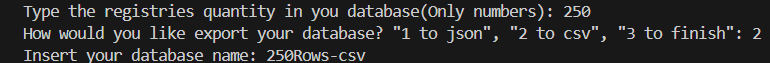
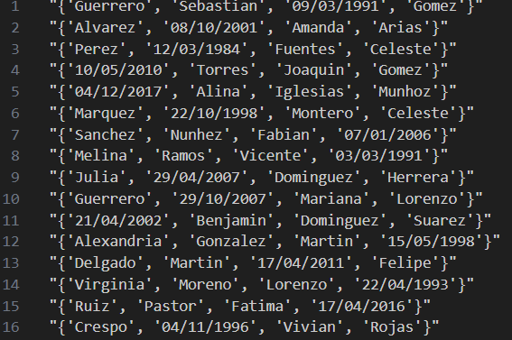
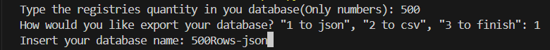
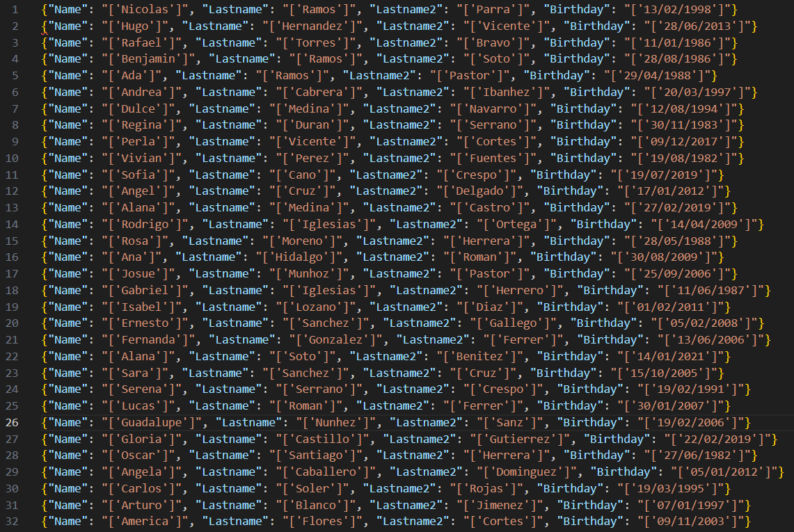

### 🧪 Random User Dataset Generator

**Type:** Python  
**Role:** Data Analyst  
**Context:** Personal Project – Data Preparation & Data Engineering Support  

---

## 🧩 Business Context
Analytics and BI teams frequently require **realistic datasets** to test queries, dashboards, data pipelines, and validation logic.  
However, real production data is often unavailable due to privacy, security, or accessibility constraints.

This project addresses that need by providing a **flexible synthetic data generator** that produces structured datasets ready for analysis.

---

## 🎯 Objective
Develop a Python-based tool capable of generating **custom-sized synthetic datasets** in **CSV or JSON format**, allowing analysts to quickly create reusable data inputs for analytical workflows.

---

## 🛠️ Tools & Technologies
- Python
- Pandas
- NumPy
- Random & Faker-style data generation
- CSV / JSON file handling

---

## ⚙️ Dataset Generation Logic
The generator follows a structured process:

- User-defined number of records
- Standardized user schema
- Realistic value distributions
- Consistent formatting across all rows
- Output format selection (CSV or JSON)

This ensures datasets are **analysis-ready** and consistent across multiple executions.

---

## 🖥️ Program Execution Examples

The following examples show the program generating a dataset in **CSV format** based on user input:
- The desired row numbers
- The exportation format (csv, json)
- Database name

##### 📄 CSV File Generation

 

###### Input

###### Output

📎 **Generated file:**  
- [CSV-File](/acanalytics/250Rows-csv.csv)

 

##### 📦 JSON File Generation
This example demonstrates the same dataset generation logic exported as a **JSON file**, suitable for APIs or NoSQL-based workflows.

 

###### Input

###### Output

📎 **Generated file:**  
- [JSON-File](/acanalytics/500Rows-json.json)

---

## 🔍 Output Validation
Basic validation steps were applied to ensure usability for analytics:

- Row count matches user-defined input
- Consistent schema across records
- No unexpected null values
- Clean formatting for direct SQL or Python ingestion

---

## 💡 Business Value
- Enables rapid prototyping and testing
- Eliminates dependency on sensitive or restricted data
- Supports SQL analysis, EDA, and BI dashboard development
- Improves efficiency in analytics and data engineering workflows

---

## 🔗 Project Resources

- 📁 **Source Code (GitLab):**  
  https://gitlab.com/acastro97/random_users_list_generator  

- 📎 **Sample Outputs:**  
  - CSV and JSON files included in this project

---
