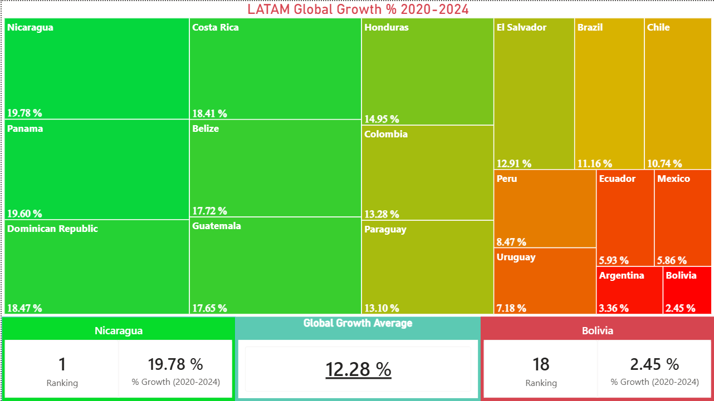
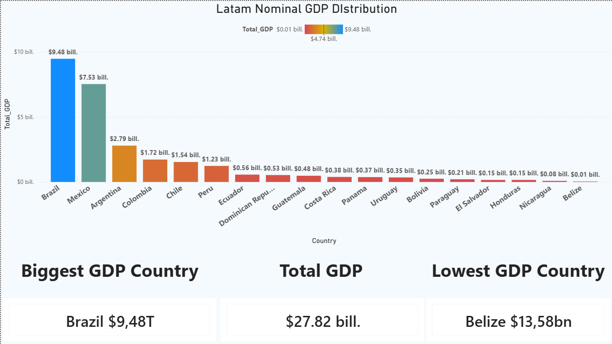
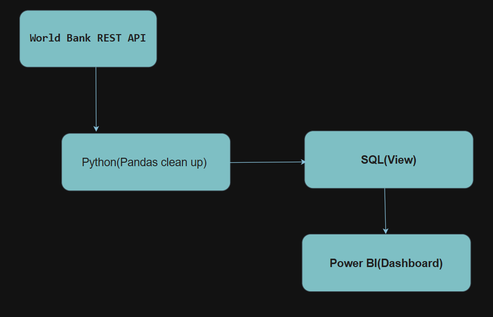

### 🗄️ LATAM GDP Performance & Economic Pipeline

**Type:** Data Engineering & Business Intelligence (E2E)  
**Role:** Data Analyst / BI Engineer  
**Context:** Personal Portfolio Project – Automated Data Pipeline & Analytics  

---

#### 🧩 Problem Context
Analyzing regional macroeconomic indicators often relies on static, disconnected spreadsheets that require manual updates. To evaluate the economic trajectory of Latin America over the 2020–2024 period, a centralized, automated pipeline was required to ingest raw World Bank data, model it cleanly in a relational database, and present actionable executive insights comparing economic volume against growth velocity.

---

#### 🎯 Objective
Build and deploy an automated **End-to-End (E2E)** data pipeline that extracts GDP metrics via REST API using Python, transforms and stores them in SQL Server, and delivers an interactive Power BI executive report featuring dynamic DAX rankings, regional benchmarks, and semantic visual storytelling.

---

#### 🛠️ Tools Used
- **Python:** requests, pandas, pyodbc (REST API Data Ingestion & ETL)
- **SQL Server:** T-SQL, Relational Data Modeling, Views (vw_fact_gdp_latam)
- **Power BI :** DAX 

---

#### 🗂️ Pipeline Architecture & Design
- **Ingestion Layer (Python):** Automated extraction of GDP growth percentage (NY.GDP.MKTP.KD.ZG) and Nominal GDP from the World Bank REST API using 3-letter ISO country codes (BRA, MEX, CRI, NIC, BOL, URY, etc.).
- **Storage & Transformation (SQL Server):** Centralized relational database staging fact data and delivering a clean analytical view (vw_fact_gdp_latam) to offload heavy calculations from the BI front-end.
- **Semantic & Presentation Layer (Power BI):** Discoupled DAX measures computing real-time rankings, top/bottom performers, regional averages, and dynamic UI labels without visual filter distortion.

---

#### 💡 Business Value
- **Automated Workflow:** Eliminates manual CSV collection; pipeline can refresh automatically as new World Bank data is published.
- **Dual Macroeconomic Perspective:** Contrasts total economic volume (Nominal GDP in USD) against growth momentum (% GDP Expansion).
- **Reduced Cognitive Load:** Executive dashboards utilize semantic color coding (Green-Yellow-Red) and key KPI cards for rapid decision-making.

---

#### 🔗 Analytical Evidence

##### 🔹 Business Question

 

##### Case #1

 

**Which Latin American economies led GDP percentage growth between 2020 and 2024, and how do they compare against the regional average?**

The objective of this analysis is to evaluate economic expansion velocity across 18 Latin American countries, identifying top performers, lagging economies, and regional benchmarks to understand post-2020 economic recovery dynamics.

##### 🔹 Analytical Approach

 

##### Case #1

 

Data ingested via Python into SQL Server was exposed through the analytical view vw_fact_gdp_latam. In Power BI, DAX measures were constructed using RANKX combined with ALL and ALLSELECTED to compute accurate regional rankings without being distorted by local visual filters.

<pre class="code-block"><code class="language-sql">
-- SQL Server Analytical View Layer
CREATE VIEW vw_fact_gdp_latam AS
SELECT 
    country_code AS ISO3,
    country_name AS Country,
    year_period AS [Year],
    gdp_growth_pct AS [PIB_%_Growth],
    nominal_gdp_usd AS [GDP_Amount]
FROM fact_gdp_latin_america;
</code></pre>

<pre class="code-block"><code class="language-dax">
// DAX: Regional Average Growth Rate (2020-2024)
Global_Growth_Average = 
CALCULATE(
    AVERAGE(vw_fact_gdp_latam[PIB_%_Growth]),
    vw_fact_gdp_latam[Year] >= 2020 && vw_fact_gdp_latam[Year] <= 2024
)

// DAX: Unfiltered Country Growth Ranking
Ranking_Growth = 
RANKX(
    ALL(vw_fact_gdp_latam[Country]), 
    [Global_Growth_%], 
    , 
    DESC
)
</code></pre>

##### 🔹 Key Findings

 

##### Case #1

 

The Treemap visualizes the 18 economies organized by area and colored via a semantic gradient (green for high expansion, yellow for average, red for lagging). The bottom cards highlight the regional extremities against the LATAM average (12.28%).

##### 🔹 Conclusions

- **Leader:** **Nicaragua** achieved the highest growth rate (**19.78%**), taking the **#1** ranking position.
- **Regional Benchmark:** The global growth average across Latin America stands at **12.28%**.
- **Lowest:** **Bolivia** recorded the lowest growth rate (**2.45%**), occupying ranking **#18**.

---

##### 🔹 Business Question

 

##### Case #2

 

**How is Nominal GDP distributed across Latin America, and which countries represent the highest concentration of total economic volume?**

While percentage growth measures speed, Nominal GDP measures scale. This analysis determines total regional GDP volume ($ USD) and identifies the dominant market players in Latin America.

##### 🔹 Analytical Approach

 

##### Case #2

 

Nominal GDP values were aggregated to calculate the total cumulative regional GDP ($27.82T). Custom DAX formatting measures were engineered using string concatenation, scale reduction (Trillions/Billions), and line breaks (UNICHAR(10)) to produce clean executive KPI cards.

<pre class="code-block"><code class="language-dax">
// DAX: Lowest GDP Country Card Label with Scaling & Line Break
Lowest_GDP_Country = 
VAR COUNTRY_NAME = TOPN(1, VALUES(vw_fact_gdp_latam[Country]), [Total_GDP], ASC)
VAR GDP = MINX(ALLSELECTED(vw_fact_gdp_latam[Country]), [Total_GDP])
VAR GDP_Formatted = FORMAT(GDP / 1000000000, "$#,##0.00") & "B"
RETURN
    COUNTRY_NAME & UNICHAR(10) & GDP_Formatted
</code></pre>

##### 🔹 Key Findings

 

##### Case #2

 

A sorted bar chart illustrates total GDP distribution alongside three centralized KPI cards displaying the market leader, total regional GDP, and smallest economy.

##### 🔹 Conclusions

- **Market Leader:** **Brazil** dominates regional economic output with **$9.48T** in Nominal GDP.
- **Total Regional Volume:** Cumulative LATAM GDP across the period reached **$27.82T**.
- **Smallest Output:** **Belize** represents the smallest nominal economic volume at **$13.58B**.

---

#### 🔗 Project Resources

- 📁 **Source Code & Scripts (GitLab):**  
  https://gitlab.com/acastro97/automated-api-data-pipeline-business-intelligence-dashboard

- 📊 **Architecture & Pipeline Diagram:**  

