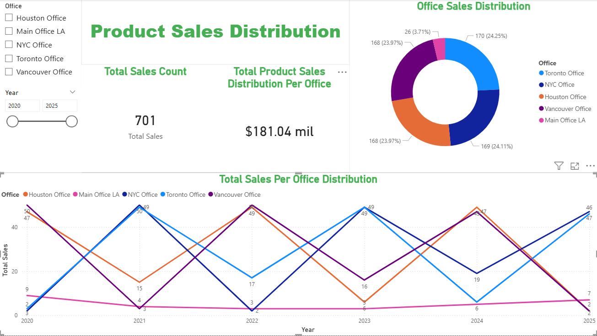
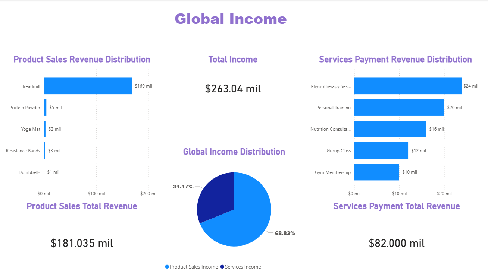

## 📊 Gym Admin BI Project – Revenue Analysis & Insights

**Project Type:** Business Intelligence & Data Visualization  
**Role:** Data Analyst  
**Tools:** Power BI (DAX), SQL  
**Context:** Personal Project – End-to-End Data Analysis (Database → Insights)

---

### 🔍 Project Overview

This project analyzes **product sales and service payments** for a gym management system. The goal is to understand **where revenue is coming from**, identify **key income drivers**, and provide **actionable insights** that could support managerial decision‑making.

The analysis combines:

* **SQL (joins, aggregations, CTEs)** for data preparation
* **Power BI** for visualization and storytelling
* A **business‑oriented approach**, focusing on revenue impact rather than raw metrics

---

## 🎯 Business Questions Addressed

1. What is the **total revenue generated** by the gym?
2. How is revenue distributed between **product sales and services**?
3. Which **products** generate the most income?
4. Which **services** contribute the most to total revenue?
5. Is revenue **concentrated or diversified** across offerings?

---

## 🧮 Data Preparation (SQL)

The dataset was prepared using SQL queries that:

* Join transactional tables with descriptive dimensions (products, services, clients)
* Aggregate totals and counts
* Use **CTEs** to improve readability and maintainability

This ensured that the data consumed by Power BI was already **clean, structured, and business‑ready**.

---

## 📈 Dashboard 1 – Product Sales Overview

### 🔎 Key Insights

* **Treadmills generate over 90% of total product revenue**, despite not having the highest number of transactions.
* Lower‑priced items (Yoga Mats, Resistance Bands, Dumbbells) sell regularly but contribute **marginally** to total income.

### 💡 Business Interpretation

* Revenue is **highly dependent on a single high‑value product**.
* While accessories support volume, they do not significantly impact revenue.

### ✅ Actionable Insight

* Consider strategies to **reduce revenue dependency** on treadmills (bundles, premium accessories, upsells).
* Review pricing or promotion strategies for low‑impact products.

---

## 📈 Dashboard 2 – Services Revenue Analysis

### 🔎 Key Insights

* **Physiotherapy Sessions and Personal Training** are the top revenue‑generating services.
* All services show a **similar number of payments**, but revenue varies due to pricing differences.

### 💡 Business Interpretation

* Revenue differences are driven primarily by **service value**, not volume.
* Premium services contribute disproportionately more income.

### ✅ Actionable Insight

* Focus marketing efforts on **high‑value services**.
* Evaluate opportunities to upsell lower‑priced services into premium packages.

---

## 📊 Dashboard 3 – Global Income Overview

### 🔎 Key Insights

* **Total Income:** $263K
* **Product Sales:** 68.8% of total revenue
* **Services Payments:** 31.2% of total revenue
* Product revenue is **less diversified**, while services show a more balanced distribution.

### 💡 Business Interpretation

* The gym relies more on **product sales** than services for total income.
* Services provide **more stable and diversified revenue**, reducing financial risk.

### ✅ Actionable Insight

* Strengthen service offerings to create **recurring and predictable income**.
* Use services to stabilize revenue against fluctuations in high‑ticket product sales.

---

## 🧠 Overall Conclusions

* Revenue is **concentrated**, particularly in treadmill sales.
* Services offer a **more balanced and sustainable revenue model**.
* A combined strategy of high‑value products and recurring services is key to long‑term stability.

---

## 🛠 Tools & Skills Demonstrated

* **SQL:** JOINs, aggregations, CTEs
* **Power BI:** Data modeling, KPIs, bar charts, revenue distributions
* **Business Analysis:** Translating data into insights and recommendations

