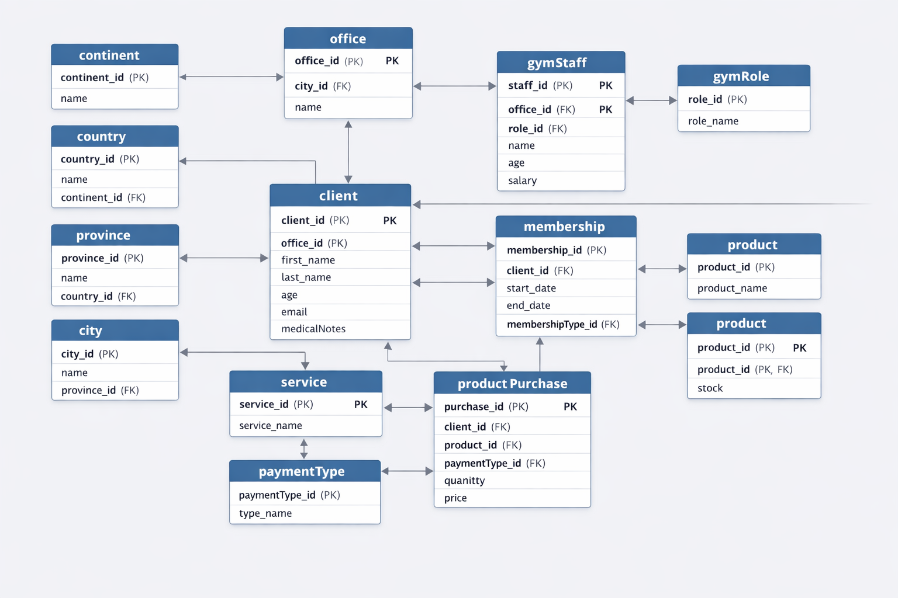

### 🗄️ Gym Relational Database Design

**Type:** SQL  
**Role:** Data Analyst  
**Context:** Personal Project – Database Design  

---

#### 🧩 Problem Context
A gym chain required a **structured and reliable relational database** to manage members, memberships, and payments, enabling future reporting and analytics.

---

#### 🎯 Objective
Design and implement a **normalized relational database** that supports operational needs and future analytical use cases.

---

#### 🛠️ Tools Used
- SQL (DDL, constraints, JOINs)
- Relational data modeling
- Data normalization

---

#### 🗂️ Database Design
- Core entities: members, memberships, payments
- Primary and foreign key relationships
- Referential integrity enforcement
- Scalable schema for future analysis

---

#### 💡 Business Value
- Centralized and consistent data storage
- Reduced data redundancy
- Reliable foundation for BI and analytics
- Easier integration with dashboards and reports

---

#### 🔗 Analytical Evidence

##### 🔹 Business Question

 

##### Case #1

 

**Which service type generates the highest total revenue?**

The objective of this analysis is to identify which type of service contributes the most to overall revenue, based on historical payment transactions. This insight helps the business understand which services drive financial performance and where to focus strategic efforts.

##### 🔹 Analytical Approach

 

##### Case #1

 

To answer this question, transactional data from the servicePayment table was combined with multiple dimension tables to enrich the analysis:

- serviceType to identify the service category
- office to capture operational context
- client to associate payments with customers
- paymentType to understand payment methods

A <strong>Common Table Expression (CTE)</strong> was used to create a clean and readable analytical dataset before applying aggregations. This approach improves query clarity and allows the logic to be easily extended for future analyses.

<pre class="code-block"><code class="language-sql">
WITH SALES_SUMMARY AS (
    SELECT ST.decription AS ServiceType, O.decription AS Office,
      CONCAT(C.Clientname,' ', C.ClientLastname1,' ',C.ClientLastname2) AS Client,
      PT.paymentTypeDescription AS PaymentType, SP.total AS Total
    FROM servicePayment AS SP 
    INNER JOIN serviceType AS ST ON SP.idService = ST.idService
    INNER JOIN office AS O ON SP.idOffice = O.idOffice
    INNER JOIN client AS C ON SP.idClient= C.idClient
    INNER JOIN paymentType AS PT ON SP.idPaymentType = PT.idPaymentType
  )
  SELECT ServiceType,SUM(Total) AS TotalRevenue,Count(*) AS TotalPayments 
  FROM SALES_SUMMARY  
  GROUP BY ServiceType
  ORDER BY TotalRevenue DESC
</code></pre>

##### 🔹 Key Findings
 

##### Case #1

 

The analysis aggregates total revenue and number of payments by service type.  
By grouping transactions at the service level and summing total payment amounts, we can clearly identify which service type generates the highest total revenue and how frequently it is purchased.

The results (shown below) are ordered by total revenue in descending order, making the top-performing services immediately visible.

##### 🔹Conclusions

-  The revenue analysis reveals that service type <strong>Physiotherapy Session</strong> is the top revenue generator. Prioritizing this category could increase operational focus and inform marketing or pricing strategies.

---

#### 🔗 Project Resources

- 📁 **Source Code (GitLab):**  
  https://gitlab.com/acastro97/gym_bd_admin

- 📊 **Database Schema & ERD:**  

